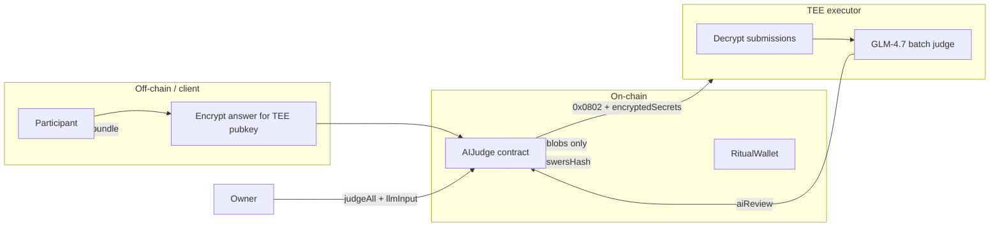

# Architecture Note: Commit-Reveal vs Ritual-Native Hidden Submissions

## Required track — commit-reveal (implemented)

### What is public

- Bounty metadata: title, rubric, deadlines, reward, owner
- Commitment hashes (`bytes32`) and submitter addresses during the commit phase
- Revealed plaintext answers after the reveal phase
- AI review bytes after `judgeAll`
- Final winner index and payout event

### What stays hidden

- Plaintext answers during the commit phase (only hashes on-chain)
- The random `salt` each participant chooses (stored off-chain in the browser's `localStorage` in this UI)

### Trust and fairness properties

- Participants cannot see others' answers before committing their own hash
- After the submission deadline, everyone reveals; unrevealed entries are excluded from judging
- Commitments bind `(answer, salt, submitter, bountyId)` so copying a hash alone is insufficient

### AI vs human responsibilities

| Step | Actor | Rationale |
|------|-------|-----------|
| Rank submissions | Ritual LLM (batch, one tx) | Scales to many entries; uses rubric |
| Pay reward | Human owner via `finalizeWinner` | Mitigates hallucination / prompt injection |

### Limitation

Answers become public **before** AI judging (during the reveal window). A patient observer could read revealed answers before `judgeAll` runs. Commit-reveal solves **copying during the commit phase**, not full privacy through judging.

---

## Advanced track — Ritual-native encrypted submissions (design)



### What is stored where

| Data | Location | Format |
|------|----------|--------|
| Encrypted answer | On-chain or content-addressed ref | Ciphertext / `bytes` |
| TEE decryption key material | Ritual secrets / DKMS (`0x081B`) | Never in plaintext on-chain |
| Plaintext answers | TEE enclave only during `judgeAll` | Ephemeral inside enclave |
| Final answer bundle | Off-chain (IPFS / storage ref) | JSON array of revealed answers |
| Bundle integrity | On-chain | `revealedAnswersHash` |

### How batch judging works

1. Each participant encrypts their answer to the registered TEE executor's public key (ECIES via Ritual privacy docs).
2. Contract stores ciphertext references only — no plaintext in storage.
3. Owner calls `judgeAll` once. The `llmInput` includes `encryptedSecrets` so the TEE decrypts all submissions inside the enclave.
4. LLM receives a single prompt containing all decrypted answers (still invisible to the public chain).
5. Contract stores `aiReview` and optionally `revealedAnswersHash` of the post-judging disclosure bundle.

### Example final output shape

```json
{
  "winnerIndex": 2,
  "ranking": [{ "index": 2, "score": 94, "reason": "Best satisfies the rubric." }],
  "revealedAnswersRef": "ipfs://Qm…",
  "revealedAnswersHash": "0x…",
  "summary": "Submission 2 is the strongest answer."
}
```

### When to choose which approach

| Criterion | Commit-reveal | Ritual-native encrypted |
|-----------|---------------|-------------------------|
| Chain portability | Any EVM | Ritual-specific |
| Implementation complexity | Low | High (encryption, secrets, TEE) |
| Hides answers through judging | No | Yes |
| Gas cost | Moderate (string storage on reveal) | Lower on-chain if ciphertext refs only |
| Bootcamp required track | **Yes** | Optional advanced |

This homework implements the **required commit-reveal track** fully, with the advanced Ritual-native flow documented here for comparison and future extension.